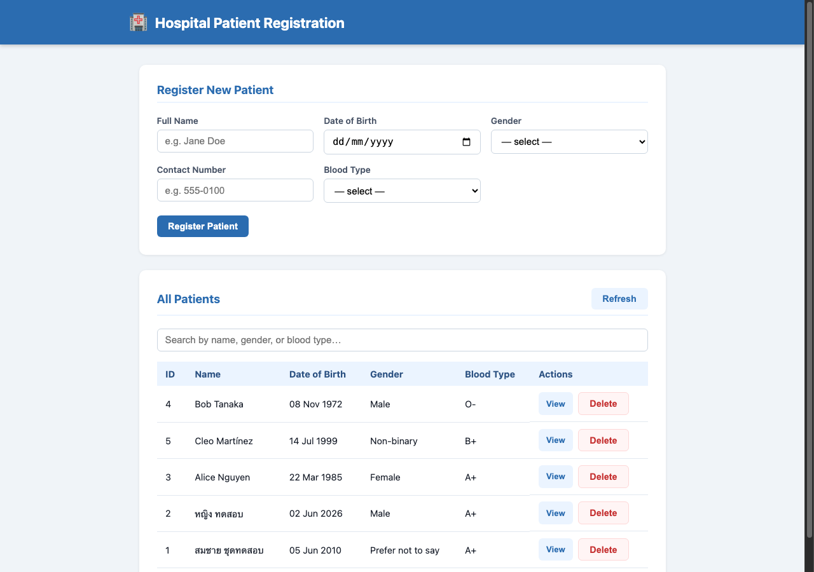

# Hospital Patient Registration

A simple hospital patient registration system with a Node.js/Express REST API, SQLite database, and a plain HTML/CSS/JS frontend.



## Features

- Register new patients (name, date of birth, gender, contact number, blood type)
- List all patients in a table
- Live search/filter by name, gender, or blood type
- View full patient record on a dedicated detail page
- Delete patient records

## Tech Stack

| Layer | Technology |
|---|---|
| Backend | Node.js, Express |
| Database | SQLite via built-in `node:sqlite` (Node 22+) |
| Frontend | HTML, CSS, JavaScript (no frameworks) |

## Getting Started

**Prerequisites:** Node.js 22 or higher

```bash
# Install dependencies
npm install

# Start the server
npm start
```

Then open http://localhost:3000 in your browser.

For development with auto-restart on file changes:

```bash
npm run dev
```

## API Endpoints

| Method | Endpoint | Description |
|---|---|---|
| `GET` | `/api/patients` | List all patients |
| `GET` | `/api/patients/:id` | Get a single patient |
| `POST` | `/api/patients` | Register a new patient |
| `DELETE` | `/api/patients/:id` | Delete a patient |

### POST `/api/patients` — request body

```json
{
  "name": "Jane Doe",
  "dob": "1990-05-14",
  "gender": "Female",
  "contact": "555-0100",
  "blood_type": "O+"
}
```

## Project Structure

```
├── server.js       # Express server and API routes
├── database.js     # SQLite setup and schema
├── package.json
└── public/
    ├── index.html   # Patient list and registration form
    ├── patient.html # Patient detail page
    ├── patient.js   # Detail page logic
    ├── style.css    # Responsive styles
    └── app.js       # List page logic (fetch, render, search)
```

The SQLite database is stored as `patients.db` in the project root and is created automatically on first run.
